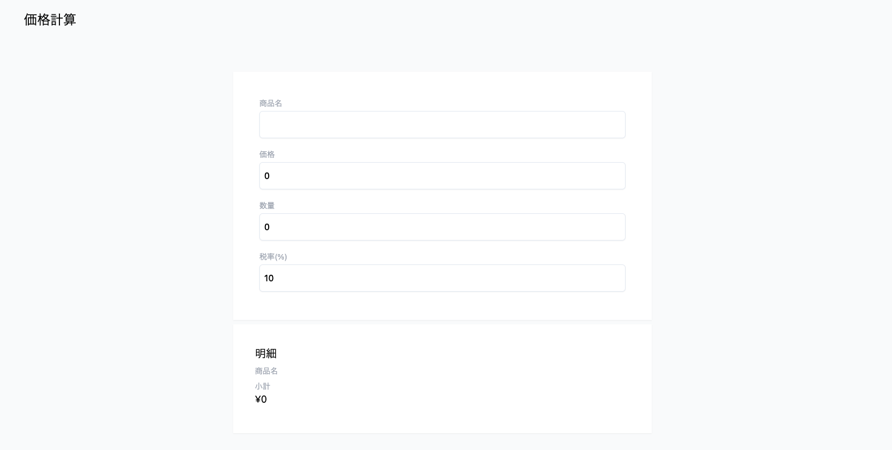

# minimal-reactive
Vue 3のリアクティビティをスクラッチで書いてみる試み

## リアクティビティサンプルコード
### reactive
```typescript
const product = reactive({ price: 100, quantity: 2 })
let total = 0
effect(_ => total = product.price * product.quantity)
// 200になるはず
console.log(total)
// setterが呼ばれるたびにtrigerが実行され、effectを再実行する => totalが変わる
// reactive effect
product.quantity = 5
// 500になるはず
console.log(total)
```

### ref
```typescript
const counter = ref(1)
let sum
effect(() => {
  sum = counter.value
})
console.log(sum) // sum = 1のはず
counter.value += 1
console.log(sum) // sum = 2になるはず
```

## 環境構築
```bash
$ npm i
```

webpack dev serverの起動
```bash
$ npm run serve
```

画面イメージ


## リファレンス
### チュートリアル、解説
- [Reactivity in Depth](https://vuejs.org//guide/extras/reactivity-in-depth.html#how-reactivity-works-in-vue)
- [Reactivity in Vue 3 - How does it work?](https://www.youtube.com/watch?v=NZfNS4sJ8CI)
- [Vue 3 Reactivity - Proxy and Reflect](https://www.vuemastery.com/courses/vue-3-reactivity/proxy-and-reflect/)

### 本家ソースコード
- [@vue/reactivity](https://github.com/vuejs/core/tree/main/packages/reactivity)
